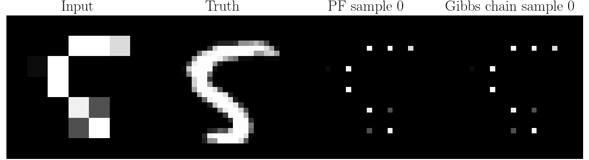

# Conditioning diffusions via explicit forward-backward bridging
[](https://github.com/zgbkdlm/fbs/actions/workflows/unittest.yml)

This repository is concerned with Markov chain Monte Carlo (MCMC) method for conditional sampling with generative diffusions, 
see, https://arxiv.org/placeholder.
More specifically, our core contributions are as follows. 

1. We develop a new and efficient particle Gibbs sampler, and a pseudo-marginal sampler for conditioning diffusion models. 
2. The proposed method is not only consistent but is also asymptotically exact, even when 1) using a finite number of particles, and 2) no access to the reference distribution.

To quickly see what our method can do while others cannot, please check the two animations below 
(you may wait for seconds for the animations to start). 




In the two animations above, we see that our Gibbs sampler gradually burns into the target distribution in a few iterations, 
while the peer method (i.e., a standard particle filter approach) can give unrealistic results due to its 
inherent statistical biases (plural!).

# Install
1. `git clone git@github.com:zgbkdlm/fbs.git`
2. `cd fbs`
3. `python venv ./venv && source venv/bin/activate` Please not use your base environment, as it may corrupt your package versions.
4. Install JAX in either GPU/CPU environment according to this official guidance https://github.com/google/jax?tab=readme-ov-file#installation.
5. `pip install -r requirements.txt`
6. `pip install -e .`

# How to reproduce the results
All the experiments-related scripts are in `./experiments`. 
Originally, all the experiments are done in a Slurm-based server (i.e., Berzlius i Linköpings universitet), and hence you 
may need to adapt the bash files in the folder to your local environment.

The scripts in `./experiments` are explained as follows.

1. `./experiments/bashes`. This folder contains the bash files that are submitted to the server for running the experiments. You can find the exact parameters that we use.
2. `./experiments/imgs`. This folder contains scripts for inpainting and super-resolution in MNIST and CelebA.
3. `./experiments/sb`. This folder is concerned with the Gaussian Schrödinger bridge experiment.
4. `./experiments/sb_imgs`. This folder is concerned with the Schrödinger bridge experiments on MNIST super-resolution.
5. `./experiments/toy`. This folder is concerned with the Gaussian synthetic experiments.

You can download the CelebA-HQ dataset as per the instruction in https://github.com/Algolzw/daclip-uir, and the scripts 
in `./experiments/datasets`.

The trained models are available at https://huggingface.co/zgbkdlm/fbs. 
Download them and copy to the folder `./experiments/checkpoints`. 
If you cannot download them, run the training scripts in `./experiments`, and you should get the exact models as we have. 

After you have run all the experiments, results will be saved in their corresponding directories. 
Then, simply run any file in `./experiments/tabulators` to produce the tables and figures in our paper.

# Citation
Please cite our paper as follows. 

```bibtex
@article{corenflos2024FBS,
    title={Conditioning diffusion models by explicit forward-backward bridging},
    author={Corenflos, Adrien and Zhao, Zheng and S\"{a}rkk\"{a}, Simo and Sj\"{o}lund, Jens and Sch\"{o}n, Thomas B.},
    journal={arXiv preprint xxx},
    year={2024}
}
```

# License
The Apache License 2.0.

# Contact
Zheng Zhao (https://zz.zabemon.com) and Adrien Corenflos (https://adriencorenflos.github.io/). 
