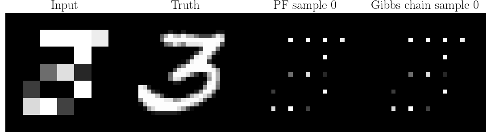

# Conditioning diffusions via explicit forward-backward bridging

This project is concerned with a Markov chain Monte Carlo (MCMC) method for conditional generative diffusions. 
More specifically, our main contributions are as follows. 

1. We develop a new and efficient particle Gibbs sampler for conditioning diffusion models. 
2. The proposed method is not only consistent but is also asymptotically exact.

In the two animations above, we can see that our Gibbs sampler burns into the target distribution in a few iterations, 
while the peer method (i.e., a standard particle filter approach) gives unrealistic results due to its 
inherent statistical biases (plural!).

# Install

# How to reproduce the results

# Citation

# Contact and license
